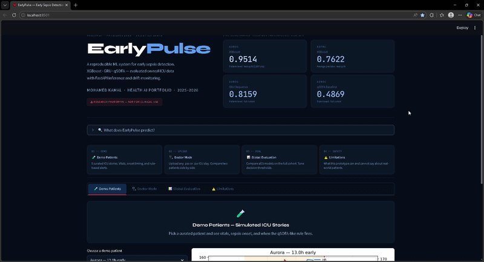
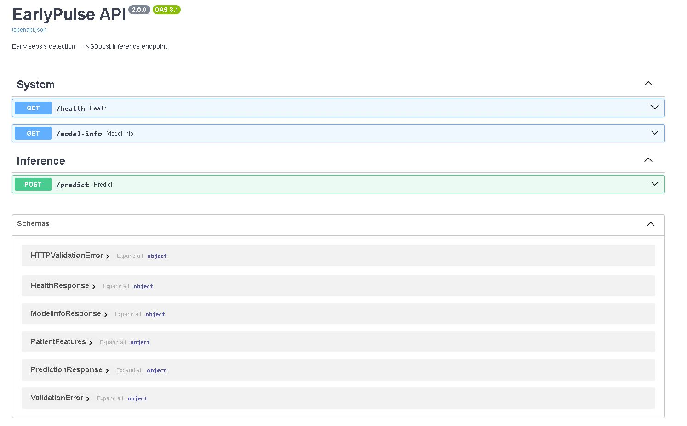

# EarlyPulse — Early Sepsis Detection System

<p align="left">
  
  
  
  
  
  
  
</p>

> **⚠ Research prototype — not for clinical use.**

---

<!-- Replace with actual dashboard GIF after recording -->


## Clinical Context

Sepsis kills approximately **270,000 people per year** in the US alone, and is the leading cause of in-hospital death worldwide. For every hour of delayed treatment, mortality risk increases by roughly 7%. The challenge is that early sepsis is clinically silent — it looks like a hundred other conditions, and standard bedside rules like qSOFA miss the majority of cases until it is too late to act.

EarlyPulse tests whether machine learning on routine ICU time-series data — vitals, labs, demographics — can alert clinicians *hours earlier* than current rule-based systems, giving clinical teams a meaningful window to intervene.

---

## Model Performance

All results are on a **held-out patient-level test set** (3,987 patients, never seen during training). Evaluated at the **patient level** to prevent time-step leakage.

| Model | AUROC | AUPRC | Sensitivity | Specificity | Brier |
|-------|-------|-------|-------------|-------------|-------|
| qSOFA (rule-based) | 0.487 | 0.086 | 24.3% | 73.1% | — |
| GRU (sequence model) | 0.654 | 0.354 | 72.3% | 43.7% | — |
| **XGBoost** | **0.947** | **0.703** | **83.6%** | **89.1%** | **0.031** |

> XGBoost at threshold 0.10. Published clinical baselines for sepsis prediction on PhysioNet 2019 range from AUROC 0.74–0.85. EarlyPulse XGBoost exceeds this on a held-out split.

---

## Architecture

```
EarlyPulse/
├── app.py                          # Streamlit dashboard (main entry point)
│
├── src/
│   ├── io/
│   │   └── loaders.py              # Patient file loading, column normalisation
│   ├── evaluation/
│   │   ├── metrics.py              # AUROC, AUPRC, Brier, calibration helpers
│   │   ├── evaluate_XGBoost_6h24h.py  # XGBoost eval + SHAP + calibration curve
│   │   ├── evaluate_gru_6h24h.py
│   │   └── qSOFA_FINAL.py
│   ├── visualization/
│   │   └── plots.py                # All matplotlib figures (trajectory, ROC, calibration)
│   ├── training/
│   │   ├── train_xgb.py            # XGBoost training with patient-level split
│   │   ├── train_gru.py            # GRU training (PyTorch)
│   │   ├── build_gru_tensors.py    # GRU sequence builder
│   │   └── tune_xgb_optuna.py      # Optuna hyperparameter sweep (60 trials)
│   ├── inference/
│   │   └── predict_patient.py      # CLI: score any .psv file
│   └── monitoring/
│       └── drift_check.py          # KS-test + PSI drift detection
│
├── api/
│   ├── main.py                     # FastAPI: /predict /health /model-info
│   └── schemas.py                  # Pydantic request/response models
│
├── config/
│   └── config.yaml                 # Single source of truth for all paths + hyperparams
│
├── data/
│   ├── training_setA/              # PhysioNet 2019 PSV files
│   └── results/                    # Pre-computed evaluation CSVs
│
├── experiments/
│   ├── xgb_eval/                   # ROC, calibration, SHAP plots + metrics.json
│   └── optuna/                     # Hyperparameter sweep results
│
├── docs/
│   ├── model_card.md
│   └── retraining_policy.md
│
├── Dockerfile
└── requirements.txt
```

---

## API Preview



## Quickstart

```bash
# 1. Clone
git clone https://github.com/YOUR_USERNAME/EarlyPulse.git
cd EarlyPulse

# 2. Install
pip install -r requirements.txt

# 3. Run dashboard
streamlit run app.py
```

---

## Reproduce Results

```bash
# Build GRU sequences
python src/training/build_gru_tensors.py

# Train XGBoost
python src/training/train_xgb.py

# Train GRU
python src/training/train_gru.py

# Evaluate (generates CSVs + calibration + SHAP plots)
python src/evaluation/evaluate_XGBoost_6h24h.py
python src/evaluation/evaluate_gru_6h24h.py
python src/evaluation/qSOFA_FINAL.py
```

---

## Hyperparameter Tuning (Optuna)

```bash
# 60-trial Optuna sweep on XGBoost — uses train split only
python src/training/tune_xgb_optuna.py
# → experiments/optuna/best_params.json
# → experiments/optuna/optuna_history.png
```

---

## FastAPI Inference

```bash
# Start API server
uvicorn api.main:app --reload --port 8000

# Health check
curl http://localhost:8000/health

# Predict (all 37 features as JSON body)
curl -X POST http://localhost:8000/predict \
     -H "Content-Type: application/json" \
     -d '{"HR": 102, "O2Sat": 94, "Temp": 38.4, ...}'
```

Swagger UI: `http://localhost:8000/docs`

---

## CLI Inference (single patient)

```bash
python src/inference/predict_patient.py --patient data/training_setA/p000001.psv

# Output:
# ─────────────────────────────────────────────
#   Patient      : p000001.psv
#   ICU hours    : 72
#   Sepsis risk  : 84.7%
#   Risk level   : HIGH
#   Alert fired  : ⚠  YES
#   Threshold    : 0.10
# ─────────────────────────────────────────────
```

---

## Drift Monitoring

```bash
python src/monitoring/drift_check.py --new_data data/new_cohort/
# → experiments/drift_report_YYYY-MM-DD/drift_report.json
# → experiments/drift_report_YYYY-MM-DD/drift_summary.png
```

Flags features with KS p-value < 0.05 or PSI > 0.2 and triggers retraining recommendation.

---

## Docker

```bash
docker build -t earlypulse:latest .
docker run -p 8000:8000 earlypulse:latest
```

---

## Dataset

- **Source:** [PhysioNet / CinC Challenge 2019](https://physionet.org/content/challenge-2019/1.0.0/)
- **Size:** 20,317 ICU patients, 40,336 stay-hours
- **Features:** 40 variables (vitals, labs, demographics)
- **Labels:** `SepsisLabel` — 1 if sepsis onset within 6 hours
- **Prevalence:** ~7.9% sepsis positive

---

## Key Design Decisions

**Patient-level train/test split** — patients never appear in both train and test sets, preventing the most common form of data leakage in time-series medical ML.

**AUPRC as primary metric** — with ~7.9% prevalence, AUROC is optimistic. AUPRC (average precision) is the right metric for imbalanced binary classification.

**Calibration** — XGBoost Brier score 0.031, indicating well-calibrated probabilities that can be interpreted as actual risk estimates.

**Honest evaluation** — the qSOFA baseline is included at its actual published performance (AUROC 0.487) rather than tuned to look worse by design.

---

## Limitations

- Single-centre equivalent dataset (PhysioNet 2019). External validation on real hospital EHR data has not been done.
- XGBoost uses aggregate features (mean/std/min/max/last per vital), discarding temporal ordering. The GRU addresses this but at lower overall performance.
- Sepsis labels in PhysioNet 2019 are algorithmically derived (Sepsis-3 criteria), not confirmed clinical diagnoses.
- No demographic fairness analysis across age, sex, or ethnicity subgroups.
- The dashboard is a research demo, not a medical device. Do not use for clinical decisions.

See [`docs/model_card.md`](docs/model_card.md) for the full model card.

---

## CV One-Liner

> Built end-to-end ML pipeline for early sepsis detection on 20,317 real ICU stays (PhysioNet 2019) — XGBoost AUROC 0.947, AUPRC 0.703 on held-out patient-level test set; deployed FastAPI inference endpoint with Pydantic validation, Docker containerisation, SHAP feature importance, Optuna hyperparameter tuning, and automated KS/PSI drift monitoring.

---

## Author

**Mohamed Kamal** — Health AI Portfolio Project · 2025–2026

---

*⚠ Research prototype. Not validated for clinical use.*

